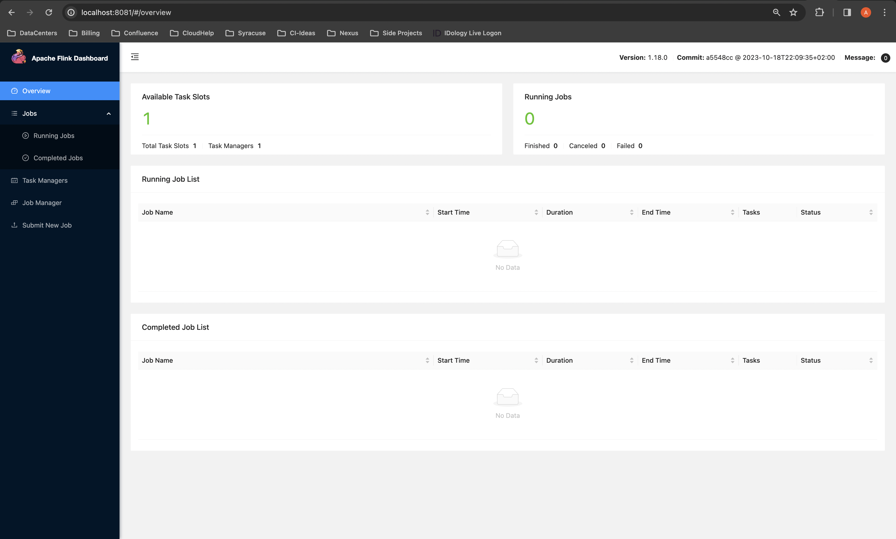
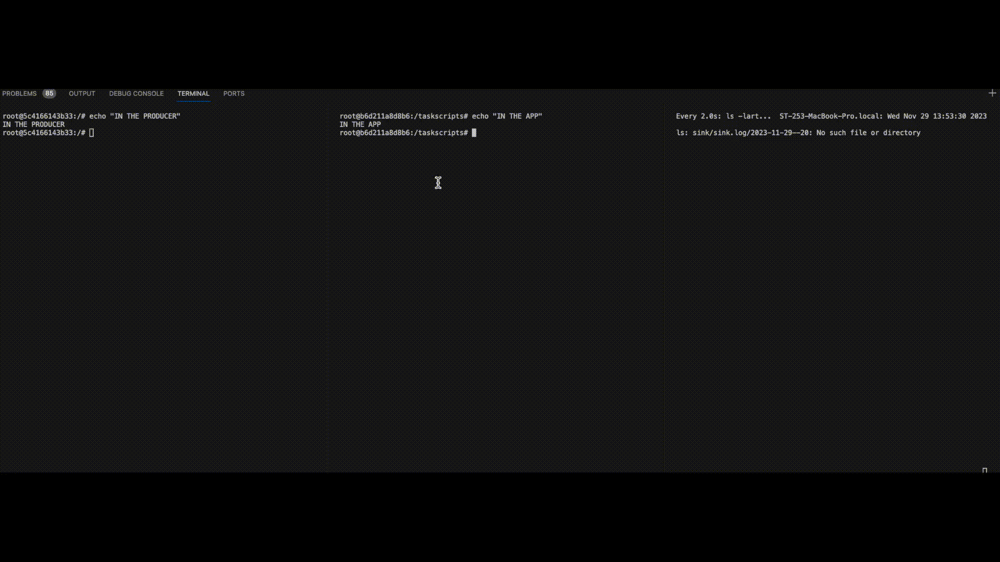

# Real Time Data Processing: Flink + Kafka + Python

Hey data enthusiasts! Have you been hearing buzz words like "Stream Processing", 
"flink", and "kafka"? Ready to embark on a journey that introduces you to all
of those things painlessly and for free? Well, you're in the right place because 
today, we're diving headfirst into the dynamic trio of Apache Flink, Kafka, and PyFlink.
We will be crafting a story that's as thrilling, informative, and hopefully easy to understand.


Let's look at the data we have at hand today. Data doesn't just sit idly in databases anymore.
It's becoming increasingly common that data flows like a lively river across systems. In recent times,
we might batch process the data at the receiving end. But, with the rise of 
Flink, we can begin to process this data in real time without adding extra load on our end systems.

Let's discuss some of the terms that we will cover today:

## Apache Flink
[Flink](https://nightlies.apache.org/flink/flink-docs-master/) is truly the unsung hero of stream processing. 
Forget about batch processing delays; Flink is here to process your data as it arrives, giving you insights on the fly. 
It's like having a data wizard at your disposal, conjuring real-time analytics with the wave of a wand.

So, really, what __is__ Flink? It's a framework and distributed processing engine for 
stateful computations over unbounded and bounded data streams. Bounded streams are what most
of us might be familiar with - it's a stream with start and end points (or bounds). Unbounded
streams, on the other hand, are continuous streams of data. They are unbounded because we don't
know when they will be finished. What makes Flink amazing is that we can provide user-defined
actions for Flink to perform on the bounded or unbounded data, in real time. We might want Flink
to write records to a database, perform some manipulation and store it on a file system,
normalize data and put it on a PubSub topic, etc. It's flexible, stateful, and resilient!

## Apache Kafka
[Kafka](https://kafka.apache.org/) is one of the backbones of the real-time data revolution. Picture it as the bustling 
central hub where data streams converge and diverge, forming a bustling metropolis of information 
exchange. Kafka ensures that no byte of data is left unexplored, connecting your applications in a 
seamless dance of communication.

At its core, Kafka is an open source distributed event streaming platform. That's a lot of dense wording,
but we can summarize it by saying that its a robust, flexible, and efficient PubSub platform. One end
will write to topics, and consumers will listen and react to the messages received from the publisher.
It helps decouple and scale our applications with asyncronous data processing.

## PyFlink
[PyFlink](https://nightlies.apache.org/flink/flink-docs-master/api/python/) is the Pythonic 
bridge to Flink's world of Java and Scala. If you're a Python aficionado, 
PyFlink is your ticket to the real-time data party. It brings the simplicity and elegance of 
Python to the robust capabilities of Flink. Because Flink is a Java framework, we can't just plug
in to Flink with Python. PyFlink is an API that we can use to interact with Flink. It's extremely
flexible, you can even load custom Flink jars into your application to use specific Java libraries, 
which is what we will do today.

## Project Overview
Now that we know what our buzz words are, we can discuss the project we will be building. We will
be building a distributed system which utilizes:

* A Flink Cluster
* A Kafka Broker
* A Flink Processing Application (Flink Task)
* A Kakfa Producer

First, we will submit our python task to our flink cluster. Then, Our producer will put messages 
on to a kafka topic. The flink task will be listening to that topic 
and when it receives a message, it will read the message, count the characters in the message, 
and then write the count to an output file. Naturally, you can implement much more
complex tasks, but this should get our feet wet!

This will all be hosted locally using [docker]() and [docker-compose](), so I will assume you
have both of those installed!

## The PyFlink App
Most of the work in this repo will be docker-related. The only code we're actually writing
will be our PyFlink app. Let's start with the python source code and bundling it into docker,
and then we'll discuss all of the other services we've hosted as well.

```python
import os


from pyflink.common import WatermarkStrategy, Encoder
from pyflink.common.serialization import SimpleStringSchema
from pyflink.common.typeinfo import Types
from pyflink.datastream import StreamExecutionEnvironment
from pyflink.datastream.connectors import FileSink, RollingPolicy, OutputFileConfig
from pyflink.datastream.connectors.kafka import KafkaOffsetsInitializer, KafkaSource


def kafka_sink_example():
    """A Flink task which sinks a kafka topic to a file on disk

    We will read from a kafka topic and then perform a count() on
    the message to count the number of characters in the message.
    We will then save that count to the file on disk.
    """
    # Create a StreamExecutionEnvironment
    env = StreamExecutionEnvironment.get_execution_environment()

    # the kafka/sql jar is used here as it's a fat jar and could avoid dependency issues
    env.add_jars("file:///jars/flink-sql-connector-kafka-3.0.1-1.18.jar")

    # Define the new kafka source with our docker brokers/topics
    # This creates a source which will listen to our kafka broker
    # on the topic we created. It will read from the earliest offset
    # and just use a simple string schema for serialization (no JSON/Proto/etc)
    kafka_source = (
        KafkaSource.builder()
        .set_bootstrap_servers(os.environ["KAFKA_BROKER"])
        .set_topics(os.environ["KAFKA_TOPIC"])
        .set_group_id("flink_group")
        .set_starting_offsets(KafkaOffsetsInitializer.earliest())
        .set_value_only_deserializer(SimpleStringSchema())
        .build()
    )

    # Adding our kafka source to our environment
    ds = env.from_source(kafka_source, WatermarkStrategy.no_watermarks(), "Kafka Source")

    # Just count the length of the string. You could get way more complex
    # here
    ds = ds.map(lambda a: len(a), output_type=Types.ROW([Types.INT()]))

    output_path = os.path.join(os.environ.get("SINK_DIR", "/sink"), "sink.log")

    # This is the sink that we will write to
    sink = (
        FileSink.for_row_format(
            base_path=output_path, encoder=Encoder.simple_string_encoder()
        )
        .with_output_file_config(OutputFileConfig.builder().build())
        .with_rolling_policy(RollingPolicy.default_rolling_policy())
        .build()
    )

    # Writing the processed stream to the file
    ds.sink_to(sink=sink)

    # Execute the job and submit the job
    env.execute("kafka_sink_example")


if __name__ == "__main__":
    kafka_sink_example()

```

Let's walk through the code:

First, we define our streaming environment and load the kafka-related
jars into it with the following lines:

```python
    # Create a StreamExecutionEnvironment
    env = StreamExecutionEnvironment.get_execution_environment()

    # the kafka/sql jar is used here as it's a fat jar and could avoid dependency issues
    env.add_jars("file:///jars/flink-sql-connector-kafka-3.0.1-1.18.jar")
```

Next, we define the kafka source. The kafka source essentially creates a kafka
consumer which listens to a specific topic. We then add that to our streaming
environment:

```python
    # Define the new kafka source with our docker brokers/topics
    # This creates a source which will listen to our kafka broker
    # on the topic we created. It will read from the earliest offset
    # and just use a simple string schema for serialization (no JSON/Proto/etc)
    kafka_source = (
        KafkaSource.builder()
        .set_bootstrap_servers(os.environ["KAFKA_BROKER"])
        .set_topics(os.environ["KAFKA_TOPIC"])
        .set_group_id("flink_group")
        .set_starting_offsets(KafkaOffsetsInitializer.earliest())
        .set_value_only_deserializer(SimpleStringSchema())
        .build()
    )

    # Adding our kafka source to our environment
    ds = env.from_source(kafka_source, WatermarkStrategy.no_watermarks(), "Kafka Source")
```

Then, we need to tell Flink what we will be doing on the data 
received from the kafka topic. We will be getting the length
of the kafka message and then saving it as a table row with a single 
integer value:

```python
    # Just count the length of the string. You could get way more complex
    # here
    ds = ds.map(lambda a: len(a), output_type=Types.ROW([Types.INT()]))
```

Now that we know what to perform on the data, we need to tell it to
put the processed data somewhere. We will do that with a sink. Our
sink will just be a file. We will write the processed contents to
a file with all of the default settings:

```python
    output_path = os.path.join(os.environ.get("SINK_DIR", "/sink"), "sink.log")

    # This is the sink that we will write to
    sink = (
        FileSink.for_row_format(
            base_path=output_path, encoder=Encoder.simple_string_encoder()
        )
        .with_output_file_config(OutputFileConfig.builder().build())
        .with_rolling_policy(RollingPolicy.default_rolling_policy())
        .build()
    )

    # Writing the processed stream to the file
    ds.sink_to(sink=sink)
```

Finally, we just have to execute our task:

```python
    # Execute the job and submit the job
    env.execute("kafka_sink_example")
```

And that is it! You have just written your first Flink task in python

Let's Docker-ize it:

```Dockerfile
FROM python:3.9.18-bullseye

ARG FLINK_VER=1.18.0 \
    POETRY_VER=1.6.1

RUN apt update -y \
    && apt-get install -y --no-install-recommends \
    openjdk-11-jdk=11.0.* \
    && pip install poetry==$POETRY_VER \
    && mkdir -p /taskscripts /jars /flink \
    && wget -O /flink/flink.tgz https://dlcdn.apache.org/flink/flink-$FLINK_VER/flink-$FLINK_VER-bin-scala_2.12.tgz \
    && tar -C /flink --strip-components 1 -zxvf /flink/flink.tgz \
    && rm /flink/flink.tgz

WORKDIR /taskscripts

COPY poetry.lock pyproject.toml ./

ENV JAVA_HOME /usr/lib/jvm/java-11-openjdk-arm64/

RUN poetry export -f requirements.txt -o requirements.txt --without-hashes \
    && pip install -r requirements.txt \
    && rm -f requirements.txt

ADD https://repo.maven.apache.org/maven2/org/apache/flink/flink-sql-connector-kafka/3.0.1-1.18/flink-sql-connector-kafka-3.0.1-1.18.jar /jars
COPY flink_with_python/* ./
```

First, we are installing OpenJDK as that is a requirement for flink. Then, we will
install poetry to be used as our venv, and then install flink itself.

```Dockerfile
FROM python:3.9.18-bullseye

ARG FLINK_VER=1.18.0 \
    POETRY_VER=1.6.1

RUN apt update -y \
    && apt-get install -y --no-install-recommends \
    openjdk-11-jdk=11.0.* \
    && pip install poetry==$POETRY_VER \
    && mkdir -p /taskscripts /jars /flink \
    && wget -O /flink/flink.tgz https://dlcdn.apache.org/flink/flink-$FLINK_VER/flink-$FLINK_VER-bin-scala_2.12.tgz \
    && tar -C /flink --strip-components 1 -zxvf /flink/flink.tgz \
    && rm /flink/flink.tgz
```

Next, we just go ahead and install our poetry/pip requirements:

```Dockerfile
WORKDIR /taskscripts

COPY poetry.lock pyproject.toml ./

ENV JAVA_HOME /usr/lib/jvm/java-11-openjdk-arm64/

RUN poetry export -f requirements.txt -o requirements.txt --without-hashes \
    && pip install -r requirements.txt \
    && rm -f requirements.txt
```

And then finally, we copy in the kafka/flink connector and our python app:

```Dockerfile
ADD https://repo.maven.apache.org/maven2/org/apache/flink/flink-sql-connector-kafka/3.0.1-1.18/flink-sql-connector-kafka-3.0.1-1.18.jar /jars
COPY flink_with_python/* ./
```

## Docker Compose Setup

We are now able to host everything: Flink, Kafka, the application, etc. We
will do that with docker compose:

```yaml
version: '3.7'
services:

  jobmanager:
    image: flink:latest
    networks:
      - flink-net
    ports:
      - 8081:8081
    environment:
      FLINK_PROPERTIES: "jobmanager.rpc.address: jobmanager"
    command:
      - jobmanager

  taskmanager:
    image: flink:latest
    networks:
      - flink-net
    environment:
      FLINK_PROPERTIES: "jobmanager.rpc.address: jobmanager"
    command:
      - taskmanager
    
  zookeeper:
    image: wurstmeister/zookeeper
    networks:
      - flink-net

  kafka:
    image: wurstmeister/kafka
    environment:
      KAFKA_ADVERTISED_HOST_NAME: kafka
      KAFKA_ADVERTISED_PORT: 9092
      KAFKA_CREATE_TOPICS: "flink-topic:1:1"
      KAFKA_ZOOKEEPER_CONNECT: zookeeper:2181
    networks:
      - flink-net
  
  app:
    # /flink/bin/flink run -py /taskscripts/app.py --jobmanager jobmanager:8081 --target local
    image: flink-app
    build: 
      context: .
    environment: 
      KAFKA_BROKER: kafka:9092
      KAFKA_TOPIC: flink-topic
      SINK_DIR: /sink
    depends_on:
      - kafka
    volumes:
      - ./sink:/sink
    entrypoint:
      - tail
    command: 
      - -f
      - /dev/null
    networks:
      - flink-net

  dummyproducer:
    # kafka-console-producer.sh --topic flink-topic --bootstrap-server kafka:9092 < /test.txt
    image: wurstmeister/kafka
    environment:
      KAFKA_ADVERTISED_HOST_NAME: kafka
      KAFKA_ADVERTISED_PORT: 9092
      KAFKA_CREATE_TOPICS: "flink-topic:1:1"
      KAFKA_ZOOKEEPER_CONNECT: zookeeper:2181
    depends_on:
      - kafka
    networks:
      - flink-net
    entrypoint:
      - tail
    command: 
      - -f
      - /dev/null
    # entrypoint:
    #   - kafka-console-producer.sh
    # command:
    #   - --topic
    #   - flink-topic
    #   - --bootstrap-server
    #   - kafka:9092
    #   - < 
    #   - /test.txt
    restart: always
    volumes:
      - ./test_files/test_messages.txt:/test.txt:ro

networks:
  flink-net:
    external: false
    name: flink-net
```

First, we see that we have two flink containers. One to
act as a job manager and one to act as a task manager. A flink
program is called a job. And the job is consisted of multiple
tasks. So we have one manager to manage the all of tasks, and one manager
for each task. In our setup, we will only be able to execute one task
at a time because we have one task manager:

```yaml
  jobmanager:
    image: flink:latest
    networks:
      - flink-net
    ports:
      - 8081:8081
    environment:
      FLINK_PROPERTIES: "jobmanager.rpc.address: jobmanager"
    command:
      - jobmanager

  taskmanager:
    image: flink:latest
    networks:
      - flink-net
    environment:
      FLINK_PROPERTIES: "jobmanager.rpc.address: jobmanager"
    command:
      - taskmanager
```

Next, we have our kafka-related applications: Zookeeper and a kafka
broker. The kafka broker will be advertised on `kafka:9092` within
the docker network and will automatically create one topic called `flink-topic`:

```yaml
  zookeeper:
    image: wurstmeister/zookeeper
    networks:
      - flink-net

  kafka:
    image: wurstmeister/kafka
    environment:
      KAFKA_ADVERTISED_HOST_NAME: kafka
      KAFKA_ADVERTISED_PORT: 9092
      KAFKA_CREATE_TOPICS: "flink-topic:1:1"
      KAFKA_ZOOKEEPER_CONNECT: zookeeper:2181
    networks:
      - flink-net
```

Finally, we have our application related services: Our app and the
dummy producer:

```yaml
  app:
    # /flink/bin/flink run -py /taskscripts/app.py --jobmanager jobmanager:8081 --target local
    image: flink-app
    build: 
      context: .
    environment: 
      KAFKA_BROKER: kafka:9092
      KAFKA_TOPIC: flink-topic
      SINK_DIR: /sink
    depends_on:
      - kafka
    volumes:
      - ./sink:/sink
    entrypoint:
      - tail
    command: 
      - -f
      - /dev/null
    networks:
      - flink-net

  dummyproducer:
    # kafka-console-producer.sh --topic flink-topic --bootstrap-server kafka:9092 < /test.txt
    image: wurstmeister/kafka
    environment:
      KAFKA_ADVERTISED_HOST_NAME: kafka
      KAFKA_ADVERTISED_PORT: 9092
      KAFKA_CREATE_TOPICS: "flink-topic:1:1"
      KAFKA_ZOOKEEPER_CONNECT: zookeeper:2181
    depends_on:
      - kafka
    networks:
      - flink-net
    entrypoint:
      - tail
    command: 
      - -f
      - /dev/null
    # entrypoint:
    #   - kafka-console-producer.sh
    # command:
    #   - --topic
    #   - flink-topic
    #   - --bootstrap-server
    #   - kafka:9092
    #   - < 
    #   - /test.txt
    restart: always
    volumes:
      - ./test_files/test_messages.txt:/test.txt:ro
```

Our app will just sit idly until we exec into it and run the command
to kick off the flink task. It will write the output to the `./sink/sink.log`
file which is a shared volume between container and your computer. The dummy
producer will read from a test file and will continually write those messages
to the kafka topic. This will give our app all of the data it needs to process
the stream.

## Running
We can run our system with a simple `docker-compose up -d`:
```shell
prompt> docker-compose up -d
[+] Building 0.0s (0/0)                                                                    docker-container:ci-env
[+] Running 6/6
 ✔ Container flink-with-python-kafka-1          Running                                                       0.0s 
 ✔ Container flink-with-python-taskmanager-1    Running                                                       0.0s 
 ✔ Container flink-with-python-zookeeper-1      Running                                                       0.0s 
 ✔ Container flink-with-python-jobmanager-1     Running                                                       0.0s 
 ✔ Container flink-with-python-app-1            Running                                                       0.0s 
 ✔ Container flink-with-python-dummyproducer-1  Started                                                       0.0s 
prompt> 
```
Note that the first time this runs, it might take a few seconds to build
the respective images as the binaries can be a bit big!

In our browser, let's just view the Flink UI at `http://localhost:8081`:


Now, let's start our flink app. We will need to exec into the application 
container and run a command to submit the task to the cluster:
```shell
prompt> docker-compose exec -it app bash           
root@8ffbf13dac16:/taskscripts# /flink/bin/flink run -py /taskscripts/app.py --jobmanager jobmanager:8081 --target local
Job has been submitted with JobID 2b295be0bcf602bad43cbee494987cd7
```

Let's also exec into our producer and send all of the files in the `/test.txt` file:
```shell
prompt> docker-compose exec -it dummyproducer bash
root@b2985a686722:/# kafka-console-producer.sh --topic flink-topic --bootstrap-server kafka:9092 < /test.txt
```

You'll see a new file popped up in the `sink` directory:

```shell
prompt> ls -larth sink/sink.log/2023-11-29--20 
total 8
drwxr-xr-x  3 owner  staff    96B Nov 29 13:38 ..
drwxr-xr-x  3 owner  staff    96B Nov 29 13:38 .
-rw-r--r--  1 owner  staff    18B Nov 29 13:38 .part-0d2ac5d6-ec07-4429-8e41-f1d989fd2a80-0.inprogress.fadc1b00-cffc-4464-b2c8-3d94603e8594
prompt> 
```

And finally, we can cat our sink file to see how it changed over the course
of the task!
```shell
prompt> cat sink/sink.log/2023-11-29--20/.part-0d2ac5d6-ec07-4429-8e41-f1d989fd2a80-0.inprogress.fadc1b00-cffc-4464-b2c8-3d94603e8594
4
2
10
16
10
9
16
```

We can watch a video of the whole system below:


I hope you enjoyed this blog post! All code can be found [here on GitHub](https://github.com/afoley587/flink-with-python)!

## References
* [Apache Flink](https://nightlies.apache.org/flink/flink-docs-master/)
* [Kafka](https://kafka.apache.org/)
* [Kafka Docker Container](https://github.com/wurstmeister/kafka-docker)
* [PyFlink](https://nightlies.apache.org/flink/flink-docs-master/api/python/)